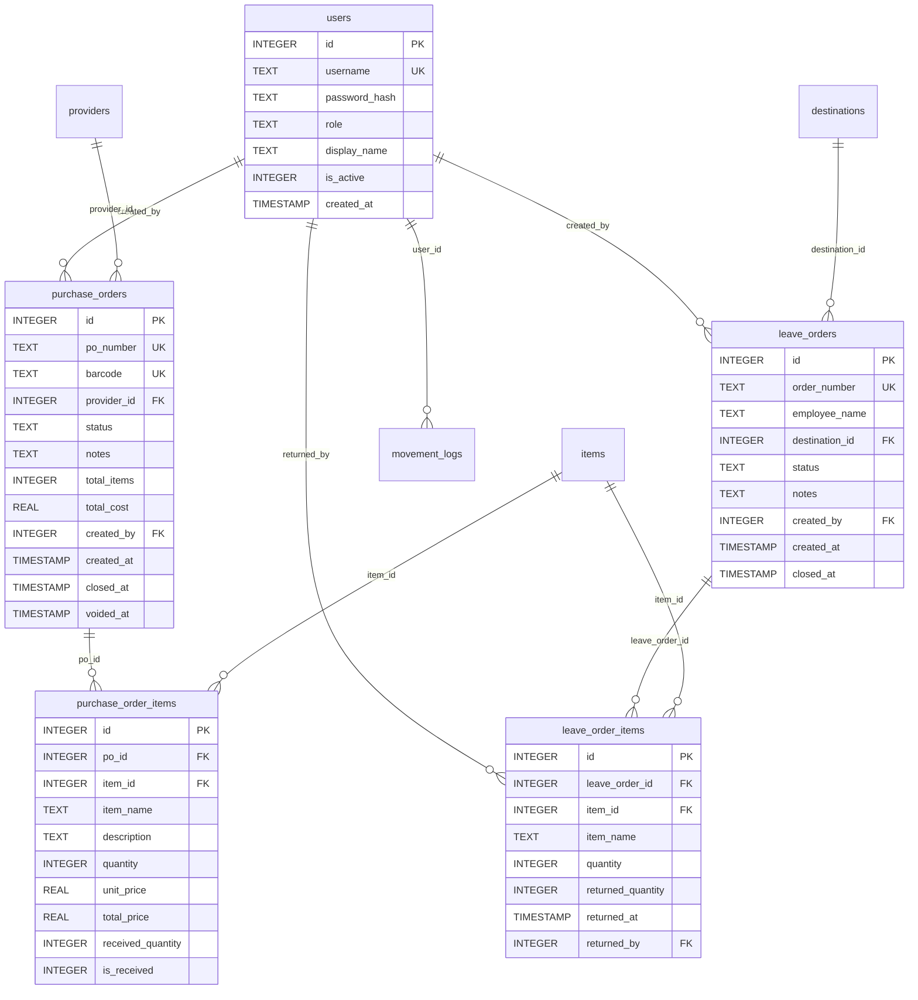

# Implementation Spec: SkyCourt 2-Operator Overhaul

> **Wayfinder Phase 4 — Handoff Document**
> All fog has been cleared. This spec contains everything needed to implement the overhaul.

---

## Executive Summary

Transform SkyCourt from a single-operator inventory app into a **2-operator system** with:
- **Authentication** with role-locked accounts
- **Warehouse Operator**: Full inventory control + Leave Order creation + PO barcode scanning
- **Office Operator**: Read-only oversight + PO creation/print + Ticket queue + Return processing
- **Turso Sync** migration for offline-capable local-first architecture

---

## Execution Order

```mermaid
gantt
    title Implementation Sequence
    dateFormat X
    axisFormat %s
    section Infrastructure
        TASK-8 Turso Sync Migration    :t8, 0, 3
        TASK-1 Auth System             :t1, 3, 6
    section Interfaces
        TASK-2 Office Op Interface     :t2, 6, 9
        TASK-3 Warehouse Op Interface  :t3, 6, 9
    section PO System
        TASK-4 PO Creation & Print     :t4, 9, 12
        TASK-5 PO Scan & Confirm       :t5, 12, 15
    section Ticket System
        TASK-6 Leave Order & Tickets   :t6, 9, 13
        TASK-7 Ticket Queue & Badge    :t7, 13, 15
```



---

## TASK-8: Migrate to Turso Sync

> **Priority**: Execute FIRST — before any new tables

### 8.1 Dependency Changes

**`requirements.txt`** — Replace `libsql` with `pyturso`:
```
Flask==2.3.3
pywebview==4.4.1
python-escpos==3.1
Flask-Cors==4.0.1
python-barcode==0.15.1
python-dotenv
pyturso
certifi
```

### 8.2 Config Changes ([config.py](file:///C:/Users/Pc/Desktop/coding/SkyCourt-Warehouse-System/app/config.py))

- Replace `import libsql` → `import turso.sync`
- Add `get_local_db_path()` → `%APPDATA%\SkyCourtWarehouse\warehouse.db`
- Keep existing SSL cert handling for frozen apps

### 8.3 Database Layer Rewrite ([db_utils.py](file:///C:/Users/Pc/Desktop/coding/SkyCourt-Warehouse-System/app/models/db_utils.py))

**Delete entirely:**
- `LibSQLConnectionWrapper` class (~45 lines)
- `LibSQLCursorWrapper` class (~50 lines)
- `LibSQLRow` class (~45 lines)

**Replace with:**
```python
import turso.sync
import sqlite3

# Connection
db = turso.sync.connect(
    path=get_local_db_path(),
    remote_url=TURSO_DATABASE_URL,
    auth_token=TURSO_AUTH_TOKEN
)
db.row_factory = sqlite3.Row  # Native — no wrapper needed
```

**New additions:**
- `SyncManager` background daemon thread (push/pull every 5s)
- `trigger_sync()` — signals immediate push after writes
- `perform_sync(push, pull)` — thread-safe sync with error handling
- `shutdown_database()` — final push on app exit via `atexit`
- Updated `get_sync_status()` → `{connected, mode: "sync", last_synced_at, last_error}`

### 8.4 Flask Integration ([main.py](file:///C:/Users/Pc/Desktop/coding/SkyCourt-Warehouse-System/app/main.py))

- `@app.after_request`: Call `trigger_sync()` on successful POST/PUT/DELETE/PATCH
- `POST /api/sync`: Manual sync endpoint (for Soft Refresh button)
- `atexit.register(shutdown_database)`

### 8.5 Entry Point ([run.py](file:///C:/Users/Pc/Desktop/coding/SkyCourt-Warehouse-System/run.py))

- Update `check_remote_lock()` to use `turso.sync.connect()` + `pull()` then check `app_remote_settings`

### 8.6 PyInstaller ([run.spec](file:///C:/Users/Pc/Desktop/coding/SkyCourt-Warehouse-System/run.spec))

- Add `collect_all('pyturso')` for native binaries
- Update `hiddenimports`: `['dotenv', 'pyturso', 'turso', 'turso.sync']`

### 8.7 Verification

- [ ] App starts, creates `%APPDATA%\SkyCourtWarehouse\warehouse.db`
- [ ] Initial `pull()` downloads all existing data from Turso Cloud
- [ ] All existing CRUD operations work (items, categories, etc.)
- [ ] Sync status badge shows connected state
- [ ] Offline test: disconnect WiFi → operations continue → reconnect → data syncs

---

## TASK-1: Build Auth System

### 1.1 Database Schema

Execute on **Turso Cloud primary** (via Turso CLI or dashboard), then `pull()`:

```sql
CREATE TABLE IF NOT EXISTS users (
    id INTEGER PRIMARY KEY AUTOINCREMENT,
    username TEXT UNIQUE NOT NULL COLLATE NOCASE,
    password_hash TEXT NOT NULL,
    role TEXT NOT NULL CHECK(role IN ('office_operator', 'warehouse_operator', 'admin')),
    display_name TEXT NOT NULL,
    is_active INTEGER NOT NULL DEFAULT 1,
    created_at TIMESTAMP DEFAULT CURRENT_TIMESTAMP
);

CREATE INDEX IF NOT EXISTS idx_users_username ON users (username);
CREATE INDEX IF NOT EXISTS idx_users_role ON users (role);
```

**Seed data** (2 preset accounts):
```sql
-- Passwords hashed via werkzeug.security.generate_password_hash()
INSERT INTO users (username, password_hash, role, display_name) VALUES
  ('office', '<hash>', 'office_operator', 'مشغل المكتب'),
  ('warehouse', '<hash>', 'warehouse_operator', 'مشغل المستودع');
```

### 1.2 Backend — New Files

**`app/models/user_model.py`**:
- `get_user_by_username(username)` → returns user row or None
- `get_user_by_id(user_id)` → returns user row or None

**`app/routes/auth_routes.py`** (Blueprint: `/api/auth`):

| Method | Route | Description |
|--------|-------|-------------|
| POST | `/api/auth/login` | Validate credentials, set `session['user']` |
| GET | `/api/auth/me` | Return current session user or 401 |
| POST | `/api/auth/logout` | Clear session |

**`app/decorators.py`** (shared auth decorators):
- `@login_required` — 401 if no session
- `@role_required('office_operator', 'warehouse_operator')` — 403 if wrong role

### 1.3 Backend — Modified Files

**`app/main.py`**:
- Set `app.secret_key`
- Register `auth_bp` blueprint
- Set `SESSION_COOKIE_HTTPONLY`, `SESSION_COOKIE_SAMESITE`, `PERMANENT_SESSION_LIFETIME`

**All existing route files** — Add `@login_required` to all endpoints. Add `@role_required()` where needed (details in TASK-2 and TASK-3).

### 1.4 Frontend — New Files

**`UI/src/context/AuthContext.tsx`**:
- `AuthProvider` wrapping the app
- `useAuth()` hook → `{user, isLoading, isAuthenticated, login, logout, hasRole}`
- Uses TanStack Query for `GET /api/auth/me` with `staleTime: Infinity`

**`UI/src/pages/Login.tsx`**:
- Arabic RTL login form (username + password)
- Error handling with `react-hot-toast`

### 1.5 Frontend — Modified Files

**`UI/src/main.tsx`** — Wrap in `<AuthProvider>`

**`UI/src/App.tsx`**:
- If `!isAuthenticated` → render `<LoginPage />`
- If authenticated → render role-appropriate layout (see TASK-2/TASK-3)

### 1.6 Movement Log Changes

**`app/models/movement_log_model.py`** — Add `user_id` column to log entries:
```sql
ALTER TABLE movement_logs ADD COLUMN user_id INTEGER REFERENCES users(id);
```
- `person_name` stays as manual text field (kept for backward compatibility)
- `user_id` auto-populated from `session['user']['id']` on every log write

---

## TASK-2: Build Office Operator Interface

> **The Office Op sees a completely different, stripped-down UI.**

### 2.1 Screens

| Screen | Access | Notes |
|--------|--------|-------|
| Dashboard | ✅ Read-only | Stats, activity feed. No edit actions. |
| Inventory Browser | ✅ Read-only | Browse items/categories/quantities. No add/edit/delete/adjust buttons. |
| Movement Logs | ✅ Read-only | View and print reports. No create actions. |
| PO Management | ✅ Full | Create, print, view history (Open/Closed/Void) |
| Tickets | ✅ Full | View leave order tickets, process returns |
| Settings | ✅ Read-only | System info |

### 2.2 New Components

- `UI/src/pages/office/OfficeDashboard.tsx` — Read-only stats dashboard
- `UI/src/pages/office/InventoryBrowser.tsx` — Read-only item browser (reuses existing item table, no action buttons)
- `UI/src/pages/office/PurchaseOrders.tsx` — PO list (tabs: Open / Closed / Void) + Create PO button
- `UI/src/pages/office/CreatePOModal.tsx` — PO creation form
- `UI/src/pages/office/TicketsPage.tsx` — Leave order ticket queue + return processing
- `UI/src/pages/office/ReturnModal.tsx` — Process return on a ticket (select items, enter return qty)

### 2.3 Sidebar

Office Op sidebar shows:
- 🏠 الرئيسية (Dashboard)
- 📦 المخزون (Inventory Browser — read-only)
- 📋 أوامر الشراء (Purchase Orders)
- 🎫 التذاكر (Tickets) — **with red badge**
- 📊 سجل الحركات (Movement Logs)
- ⚙️ الإعدادات (Settings)

### 2.4 Backend Route Protection

Add `@role_required('warehouse_operator', 'admin')` to:
- POST/PUT/DELETE `/api/items/*` (create, edit, status change, adjust)
- POST/PUT/DELETE `/api/categories/*`
- POST/PUT/DELETE `/api/units/*`
- POST/PUT/DELETE `/api/destinations/*`
- POST/PUT/DELETE `/api/providers/*`

Office Op's only write endpoints:
- POST `/api/purchase-orders/` (create PO)
- POST `/api/tickets/<id>/return` (process return — auto re-adds to inventory)

---

## TASK-3: Build Warehouse Operator Interface

> **Gets the current full UI unchanged + new features**

### 3.1 Screens

Everything that exists today, **plus**:
- **Leave Order Creation** screen/modal
- **PO Scan & Confirm** screen (see TASK-5)

### 3.2 New Components

- `UI/src/pages/warehouse/LeaveOrders.tsx` — Leave order list + Create button
- `UI/src/pages/warehouse/CreateLeaveOrderModal.tsx` — Form: employee name, destination, item selection with quantities, notes. **Blocks creation if insufficient stock.**
- `UI/src/pages/warehouse/POScanScreen.tsx` — PO barcode scan + item review + confirm (see TASK-5)

### 3.3 Sidebar

Warehouse Op sidebar shows (existing pages + new):
- 🏠 الرئيسية (Dashboard)
- 📦 إدارة الأصناف (Item Management)
- 📋 أوامر الخروج (Leave Orders) — **NEW**
- 🔍 استلام أمر شراء (PO Scan) — **NEW**
- 📊 سجل الحركات (Movement Logs)
- 📏 الوحدات (Units)
- 📍 الوجهات (Destinations)
- 🚛 الموردين (Providers)
- ⚙️ الإعدادات (Settings)

---

## TASK-4: Build PO Creation & Print Flow

### 4.1 Database Schema

```sql
CREATE TABLE IF NOT EXISTS purchase_orders (
    id INTEGER PRIMARY KEY AUTOINCREMENT,
    po_number TEXT UNIQUE NOT NULL,          -- 'PO-000001' format
    barcode TEXT UNIQUE NOT NULL,            -- 'PO-000001' (same as po_number, used for scanning)
    provider_id INTEGER REFERENCES providers(id),
    status TEXT NOT NULL DEFAULT 'open' CHECK(status IN ('open', 'closed', 'void')),
    notes TEXT,
    total_items INTEGER DEFAULT 0,
    total_cost REAL DEFAULT 0,
    created_by INTEGER REFERENCES users(id),
    created_at TIMESTAMP DEFAULT CURRENT_TIMESTAMP,
    closed_at TIMESTAMP,
    voided_at TIMESTAMP
);

CREATE TABLE IF NOT EXISTS purchase_order_items (
    id INTEGER PRIMARY KEY AUTOINCREMENT,
    po_id INTEGER NOT NULL REFERENCES purchase_orders(id) ON DELETE CASCADE,
    item_id INTEGER NOT NULL REFERENCES items(id),
    item_name TEXT NOT NULL,                  -- Snapshot at PO creation time
    description TEXT,                         -- Notes per line item
    quantity INTEGER NOT NULL,
    unit_price REAL NOT NULL,
    total_price REAL NOT NULL,                -- Auto-calculated: quantity × unit_price
    received_quantity INTEGER,                -- Filled by warehouse op at scan time
    is_received INTEGER DEFAULT 0             -- 0 = pending, 1 = received, -1 = struck-off
);

CREATE INDEX IF NOT EXISTS idx_po_status ON purchase_orders (status);
CREATE INDEX IF NOT EXISTS idx_po_created_at ON purchase_orders (created_at);
CREATE INDEX IF NOT EXISTS idx_po_items_po_id ON purchase_order_items (po_id);
```

### 4.2 Auto-Void Logic

Background job or `@app.before_request` check:
```python
# Auto-void POs older than 2 days that are still 'open'
UPDATE purchase_orders
SET status = 'void', voided_at = CURRENT_TIMESTAMP
WHERE status = 'open'
  AND created_at < datetime('now', '-2 days');
```

### 4.3 API Endpoints

**`app/routes/po_routes.py`** (Blueprint: `/api/purchase-orders`):

| Method | Route | Auth | Description |
|--------|-------|------|-------------|
| GET | `/` | Any | List POs (filter by `status`, paginated) |
| GET | `/<id>` | Any | Get PO with items |
| GET | `/by-barcode/<barcode>` | Any | Lookup PO by barcode value |
| POST | `/` | `office_operator` | Create PO with items |
| POST | `/<id>/void` | `office_operator` | Void a PO |
| POST | `/<id>/receive` | `warehouse_operator` | Confirm PO receipt (see TASK-5) |
| GET | `/<id>/barcode` | Any | Generate PO barcode image (base64) |

### 4.4 PO Barcode Strategy (RES-2 Resolved)

- **Format**: `PO-XXXXXX` (e.g. `PO-000042`)
- **Encoding**: Same Code128 as item barcodes — the existing `barcode_service.py` handles it
- **Routing**: In scanner overlay `onScan` handler:
  ```typescript
  if (scannedValue.startsWith('PO-')) {
    // Route to PO confirm flow
    navigateToPOConfirm(scannedValue);
  } else {
    // Existing item barcode flow
    lookupItemByBarcode(scannedValue);
  }
  ```

### 4.5 PO Print (RES-3 Resolved)

**Approach**: `react-to-print` with hidden `PrintablePurchaseOrder` component (same pattern as existing [`PrintableReport.tsx`](file:///C:/Users/Pc/Desktop/coding/SkyCourt-Warehouse-System/UI/src/components/PrintableReport.tsx)).

**New component**: `UI/src/components/PrintablePurchaseOrder.tsx`
- A4, Arabic RTL
- Layout per GRILL-4 design:

```
┌─────────────────────────────────────────────────┐
│  Logo    │  [BARCODE]  │  PO: PO-000042        │
│          │             │  أمر شراء رقم          │
│          │             │  Company Name عربي      │
│          │             │  Company Name English   │
├─────────────────────────────────────────────────┤
│  #  │  الصنف  │  الوصف  │  الكمية │ سعر الوحدة │  السعر  │
│  1  │  Item A │  ...    │    10   │    50      │   500   │
│  2  │  Item B │  ...    │     5   │   100      │   500   │
├─────────────────────────────────────────────────┤
│                              │ المجموع │    15   │        │  1000   │
├─────────────────────────────────────────────────┤
│  العنوان: ...                              التوقيع:      │
│  الهاتف: ...                               __________    │
│  الموقع: ...                                             │
└─────────────────────────────────────────────────┘
```

---

## TASK-5: Build PO Scan & Confirm Flow

### 5.1 Warehouse Operator Workflow

1. Open PO Scan screen (or scan from anywhere with scanner overlay open)
2. Scan PO barcode → `GET /api/purchase-orders/by-barcode/PO-000042`
3. Review screen shows all items in the PO with quantities
4. Warehouse Op can:
   - ✅ Confirm each item (toggle checkboxes)
   - ✏️ Adjust quantities per item (partial delivery)
   - ❌ Strike off items not received (toggle off)
5. Click "Confirm Receipt" → `POST /api/purchase-orders/<id>/receive`
6. Backend:
   - For each confirmed item: calls existing `record_quantity_adjustment` (Addition)
   - Updates `purchase_order_items.received_quantity` and `is_received`
   - Sets `purchase_orders.status = 'closed'`, `closed_at = now()`
   - Creates movement log entries (type: `'Addition'`, linked to PO)

### 5.2 Scanner Overlay Modification

Modify [`BarcodeScannerOverlay.tsx`](file:///C:/Users/Pc/Desktop/coding/SkyCourt-Warehouse-System/UI/src/components/BarcodeScannerOverlay.tsx) `onScan` handler in parent component:

```typescript
const handleScan = (barcode: string) => {
  if (barcode.startsWith('PO-')) {
    // Navigate to PO confirm screen with this barcode
    setPOBarcode(barcode);
    setActivePage('POConfirm');
  } else {
    // Existing item barcode flow
    fetchItemByBarcode(barcode);
  }
};
```

### 5.3 New Components

- `UI/src/pages/warehouse/POConfirmScreen.tsx` — Shows PO details + item checklist with qty editors + confirm button
- `UI/src/components/POItemRow.tsx` — Individual item row with checkbox, qty input, strike-through toggle

---

## TASK-6: Build Leave Order & Ticket System

### 6.1 Database Schema

```sql
CREATE TABLE IF NOT EXISTS leave_orders (
    id INTEGER PRIMARY KEY AUTOINCREMENT,
    order_number TEXT UNIQUE NOT NULL,         -- 'LO-000001' format
    employee_name TEXT NOT NULL,
    destination_id INTEGER REFERENCES destinations(id),
    status TEXT NOT NULL DEFAULT 'open' CHECK(status IN ('open', 'partially_returned', 'closed')),
    notes TEXT,
    created_by INTEGER REFERENCES users(id),   -- Warehouse operator
    created_at TIMESTAMP DEFAULT CURRENT_TIMESTAMP,
    closed_at TIMESTAMP
);

CREATE TABLE IF NOT EXISTS leave_order_items (
    id INTEGER PRIMARY KEY AUTOINCREMENT,
    leave_order_id INTEGER NOT NULL REFERENCES leave_orders(id) ON DELETE CASCADE,
    item_id INTEGER NOT NULL REFERENCES items(id),
    item_name TEXT NOT NULL,                    -- Snapshot at creation
    quantity INTEGER NOT NULL,                  -- Quantity taken out
    returned_quantity INTEGER DEFAULT 0,        -- Quantity returned (updated by office op)
    returned_at TIMESTAMP,                      -- When return was processed
    returned_by INTEGER REFERENCES users(id)   -- Office operator who processed return
);

CREATE INDEX IF NOT EXISTS idx_lo_status ON leave_orders (status);
CREATE INDEX IF NOT EXISTS idx_lo_created_at ON leave_orders (created_at);
CREATE INDEX IF NOT EXISTS idx_lo_items_order_id ON leave_order_items (leave_order_id);
```

### 6.2 API Endpoints

**`app/routes/leave_order_routes.py`** (Blueprint: `/api/leave-orders`):

| Method | Route | Auth | Description |
|--------|-------|------|-------------|
| GET | `/` | Any | List leave orders (filter by `status`, paginated) |
| GET | `/<id>` | Any | Get leave order with items |
| POST | `/` | `warehouse_operator` | Create leave order (validates stock) |
| POST | `/<id>/close` | `warehouse_operator` | Close ticket |
| GET | `/tickets/count` | Any | Count of open tickets (for badge) |

**`app/routes/ticket_routes.py`** (Blueprint: `/api/tickets`):

| Method | Route | Auth | Description |
|--------|-------|------|-------------|
| GET | `/` | `office_operator` | List tickets (leave orders) for office op |
| GET | `/<id>` | `office_operator` | Get ticket details |
| POST | `/<id>/return` | `office_operator` | Process return on ticket items |

### 6.3 Leave Order Creation (Warehouse Op)

- Form: employee name, destination (dropdown), item selection (searchable), quantities, notes
- **Stock validation**: Before creation, check `items.current_quantity >= requested_quantity` for each item
  - If any item insufficient → **block creation** with error message
- On creation:
  - Deduct quantities from `items.current_quantity`
  - Create `movement_logs` entries (type: `'Removal'`)
  - Set status = `'open'`

### 6.4 Return Processing (Office Op)

- Office Op opens a ticket → sees item list with original quantities
- Clicks "Process Return" → modal shows items with input for return quantity
- On confirm:
  - Updates `leave_order_items.returned_quantity`, `returned_at`, `returned_by`
  - **Auto re-adds returned quantity** to `items.current_quantity`
  - Creates `movement_logs` entry (type: `'Return'`, new action type)
  - Original quantity stays visible, struck through with return annotation
  - If any items have returns → status changes to `'partially_returned'`
  - Office Op can also mark ticket as `'closed'` when done

### 6.5 Display Rules

On tickets, each item shows:
```
Item A:  ~~10~~ → returned 2 (net: 8 taken)
Item B:  5 (no return)
```

---

## TASK-7: Implement Ticket Queue & Badge Sync

### 7.1 React Query Hooks

```typescript
// hooks/useTickets.ts

// 1. Badge count — runs globally in sidebar (5s polling)
export const useOpenTicketsCount = () => useQuery({
  queryKey: ['tickets', 'open-count'],
  queryFn: () => apiClient.get<{ count: number }>('/leave-orders/tickets/count'),
  refetchInterval: 5000,
  staleTime: 4000,
  refetchOnWindowFocus: true,
});

// 2. Ticket list — runs only on Tickets page (5s polling)
export const useTicketsList = (status: string) => useQuery({
  queryKey: ['tickets', 'list', status],
  queryFn: () => apiClient.get<LeaveOrder[]>(`/tickets?status=${status}`),
  refetchInterval: 5000,
  refetchOnWindowFocus: true,
});
```

### 7.2 Sidebar Badge

In Office Op's sidebar, the Tickets nav item shows a red circle badge:
```tsx
<SidebarItem title="التذاكر" icon={<Ticket size={20} />}>
  {openCount > 0 && (
    <span className="bg-red-500 text-white text-xs rounded-full px-1.5 py-0.5 min-w-[20px] text-center">
      {openCount}
    </span>
  )}
</SidebarItem>
```

### 7.3 Optimistic Updates

When Office Op processes a return or closes a ticket:
```typescript
onSuccess: () => {
  queryClient.invalidateQueries({ queryKey: ['tickets'] });
}
```

---

## New Database Schema Summary



---

## File Change Summary

### New Files to Create

| File | Purpose |
|------|---------|
| `app/models/user_model.py` | User queries |
| `app/models/po_model.py` | Purchase order queries |
| `app/models/leave_order_model.py` | Leave order queries |
| `app/routes/auth_routes.py` | Login/logout/me endpoints |
| `app/routes/po_routes.py` | PO CRUD + receive endpoints |
| `app/routes/leave_order_routes.py` | Leave order + ticket endpoints |
| `app/decorators.py` | `@login_required`, `@role_required` |
| `UI/src/context/AuthContext.tsx` | Auth state management |
| `UI/src/pages/Login.tsx` | Login screen |
| `UI/src/pages/office/OfficeDashboard.tsx` | Read-only dashboard |
| `UI/src/pages/office/InventoryBrowser.tsx` | Read-only inventory |
| `UI/src/pages/office/PurchaseOrders.tsx` | PO list + management |
| `UI/src/pages/office/CreatePOModal.tsx` | PO creation form |
| `UI/src/pages/office/TicketsPage.tsx` | Ticket queue |
| `UI/src/pages/office/ReturnModal.tsx` | Return processing |
| `UI/src/pages/warehouse/LeaveOrders.tsx` | Leave order list |
| `UI/src/pages/warehouse/CreateLeaveOrderModal.tsx` | Leave order creation |
| `UI/src/pages/warehouse/POScanScreen.tsx` | PO scan confirmation |
| `UI/src/components/PrintablePurchaseOrder.tsx` | PO print layout |
| `UI/src/components/OfficeSidebar.tsx` | Office op navigation |
| `UI/src/components/WarehouseSidebar.tsx` | Warehouse op navigation |
| `UI/src/hooks/useTickets.ts` | Ticket polling hooks |
| `UI/src/hooks/usePurchaseOrders.ts` | PO query hooks |
| `UI/src/hooks/useLeaveOrders.ts` | Leave order hooks |
| `UI/src/hooks/useAuth.ts` | Auth hook (re-export) |
| `UI/src/services/poService.ts` | PO API client |
| `UI/src/services/leaveOrderService.ts` | Leave order API client |
| `UI/src/services/authService.ts` | Auth API client |

### Existing Files to Modify

| File | Changes |
|------|---------|
| `app/config.py` | `libsql` → `turso.sync`, add `get_local_db_path()` |
| `app/models/db_utils.py` | Full rewrite — delete wrappers, Turso Sync connection, background sync daemon |
| `app/main.py` | Add secret key, register new blueprints, `after_request` sync trigger, `atexit` |
| `app/routes/items_routes.py` | Add `@login_required`, `@role_required` on write endpoints |
| `app/routes/category_routes.py` | Add `@login_required`, `@role_required` on write endpoints |
| `app/routes/units_routes.py` | Add `@login_required`, `@role_required` on write endpoints |
| `app/routes/destination_routes.py` | Add `@login_required`, `@role_required` on write endpoints |
| `app/routes/provider_routes.py` | Add `@login_required`, `@role_required` on write endpoints |
| `app/models/movement_log_model.py` | Add `user_id` parameter to log creation |
| `app/services/item_service.py` | Pass `user_id` from session to movement log calls |
| `app/services/barcode_service.py` | No changes (Code128 already supports `PO-` prefix) |
| `UI/src/main.tsx` | Wrap in `<AuthProvider>` |
| `UI/src/App.tsx` | Login gate + role-based layout switching |
| `UI/src/components/Sidebar.tsx` | Split into OfficeSidebar / WarehouseSidebar (or conditional rendering) |
| `UI/src/components/BarcodeScannerOverlay.tsx` | Add `PO-` prefix routing in `onScan` handler |
| `UI/src/types.ts` | Add `User`, `PurchaseOrder`, `LeaveOrder`, `Ticket` types |
| `requirements.txt` | `libsql` → `pyturso` |
| `run.py` | Update `check_remote_lock()` for Turso Sync |
| `run.spec` | Add `collect_all('pyturso')` |
| `database/schema.sql` | Add `users`, `purchase_orders`, `purchase_order_items`, `leave_orders`, `leave_order_items` tables |

---

## Movement Log Action Types (Updated)

| Action Type | Trigger | Who |
|-------------|---------|-----|
| `Creation` | New item added | Warehouse Op |
| `Addition` | Stock inbound (manual adjust or PO confirm) | Warehouse Op |
| `Removal` | Stock outbound (manual adjust or leave order creation) | Warehouse Op |
| `Return` | **NEW** — Items returned via ticket | Office Op |
| `Update` | Item details edited | Warehouse Op |
| `Status Change` | Item activated/deactivated | Warehouse Op |
| `Restored` | Archived item restored | Warehouse Op |

---

> [!IMPORTANT]
> **DDL Execution Order**: All `CREATE TABLE` and `ALTER TABLE` statements must be executed on the **Turso Cloud primary** first (via CLI or dashboard), then each app instance pulls the schema with `db.pull()`. This is a Turso Sync requirement.

> [!TIP]
> **Recommended implementation sequence**: TASK-8 → TASK-1 → TASK-6 → TASK-7 → TASK-4 → TASK-5 → TASK-2 → TASK-3. This front-loads infrastructure and the simpler ticket system before the more complex PO print/scan flow.
